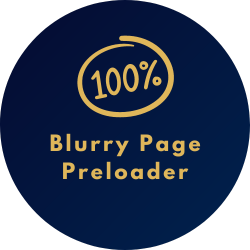

<div align="center">
  
  <h1 align="center">Simple Progress Steps Widget</h1>
</div>

<details>
  <summary>Table of Contents</summary>
  <ol>
    <li>
      <a href="#about">About The Project</a>
      <ul>
        <li><a href="#built-with">Built With</a></li>
      </ul>
    </li>
    <li><a href="#usage">Usage</a></li>
    <li><a href="#javascript-functionality">JavaScript Functionality</a></li>
    <li><a href="#styling">Styling</a></li>
    <li><a href="#conclusion">Conclusion</a></li>
    <li><a href="#license">License</a></li>
    <li><a href="#contact">Contact</a></li>
  </ol>
</details>


<p align="right">(<a href="#readme-top">back to top</a>)</p>

## About

This project is a progress steps widget built using HTML5, CSS3, and JavaScript. The widget provides a visual representation of progress through a series of steps, allowing users to navigate between steps and track their progress.

### Built With
* [![HTML5][HTML5]][HTML5-url]
* [![CSS3][CSS3]][CSS3-url]
* [![JS][JS]][JS-url]

## Usage

To use the progress steps widget, follow these steps:

1. Include the required HTML markup in your web page:

```html
<!DOCTYPE html>
<html lang="en">
<head>
    <link rel="stylesheet" href="css/styles.css">
    <meta charset="UTF-8">
    <title>Title</title>
</head>
<body>
    <div class="container">
        <div class="progress-container">
            <div class="progress" id="progress"></div>
                <div class="circle active">1</div>
                <div class="circle">2</div>
                <div class="circle">3</div>
                <div class="circle">4</div>
        </div>
        <button class="btn" id="#prev" type="button" disabled>Prev</button>
        <button class="btn" id="#next" type="button">Next</button>
    </div>
<script src="js/main.js"></script>
</body>
</html>
```

2. Link the CSS stylesheets by adding the following line within the <head> section of your HTML file:

```html
<link rel="stylesheet" href="css/styles.css">
```

3. Include the JavaScript code by adding the following line before the closing </body> tag of your HTML file:

```html
<script src="js/main.js"></script>
```

4. Customize the number of steps by modifying the HTML markup. Add or remove <div class="circle"></div> elements as needed, and update the corresponding JavaScript code accordingly.

5. Run the web page in a web browser to see the progress steps widget in action. You should be able to navigate between steps using the "Prev" and "Next" buttons.
<p align="right">(<a href="#readme-top">back to top</a>)</p>

## JavaScript Functionality

The JavaScript code included in the project provides the functionality for the progress steps widget. It allows users to move forward or backward through the steps and updates the visual representation of the progress.

The key JavaScript functions used in this project are:

* `next`: This function is called when the "Next" button is clicked. It increments the `currentActive` variable, ensuring it does not exceed the total number of steps. Then, it calls the `update` function to update the widget's appearance.

* `prev`: This function is called when the "Prev" button is clicked. It decrements the `currentActive` variable, making sure it does not go below 1 (the first step). It then calls the `update` function to update the widget's appearance.

* `update`: This function updates the widget's appearance based on the current step (`currentActive`). It enables or disables the "Prev" and "Next" buttons as necessary, adds the "active" class to the circles representing completed steps, and adjusts the width of the progress bar based on the progress made.

Please note that if you want to modify the behavior or add more functionality to the progress steps widget, you can do so by modifying the JavaScript code accordingly.
<p align="right">(<a href="#readme-top">back to top</a>)</p>

## Styling
The CSS styles provided in the `styles.css` file control the visual appearance of the progress steps widget. You can customize these styles to match your desired design.
<p align="right">(<a href="#readme-top">back to top</a>)</p>

## Conclusion
The progress steps widget is a simple and intuitive way to guide users through a series of steps. By using HTML5, CSS3, and JavaScript, this project provides an easy-to-implement solution for incorporating progress tracking into your web pages. Feel free to modify and expand upon this project to suit your specific needs.
<p align="right">(<a href="#readme-top">back to top</a>)</p>


## License

Distributed under the MIT License.

<p align="right">(<a href="#readme-top">back to top</a>)</p>


## Contact

Alireza Mohafezatkar - https://www.linkedin.com/in/alireza-mohafezatkar/ - alireza.mohafezatkar@gmail.com

Project Link: [https://github.com/mohafezatkar/simple-progress-steps-widget](https://github.com/mohafezatkar/simple-progress-steps-widget)

<p align="right">(<a href="#readme-top">back to top</a>)</p>

[linkedin-shield]: https://img.shields.io/badge/-LinkedIn-black.svg?style=for-the-badge&logo=html&colorB=555
[linkedin-url]: https://www.linkedin.com/in/alireza-mohafezatkar/
[product-screenshot]: images/screenshot.png
[HTML5]: https://img.shields.io/badge/html5-8F3C18?style=for-the-badge&logo=html5&logoColor=orange
[HTML5-url]: https://developer.mozilla.org/en-US/docs/Web/HTML
[CSS3]: https://img.shields.io/badge/css3-2B88CB?style=for-the-badge&logo=css3&logoColor=blue
[CSS3-url]: https://css-tricks.com/
[JS]: https://img.shields.io/badge/javascript-000000?style=for-the-badge&logo=javascript&logoColor=yellow
[JS-url]: https://www.javascript.com/

